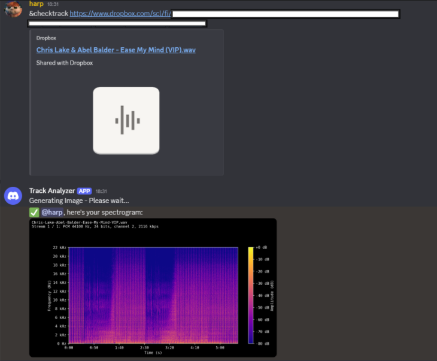

# Discord Spectrogram Bot

A simple Discord bot that generates spectrogram images from `.wav` audio files hosted on Dropbox.

## Features

- Generates spectrograms from audio files
- Only supports `.wav` format
- Displays audio metadata (sample rate, bit depth, channels)
- Responds with an image in Discord
- Works with Dropbox public share links

## Requirements

- Python 3.8+
- ffmpeg (must be installed and available in PATH)

## Installation

```bash
git clone https://github.com/your-username/spectrogram-discord-bot.git
cd spectrogram-discord-bot
pip install -r requirements.txt
```

Create a .env file and add your discord bot token 
```DISCORD_TOKEN=your_discord_bot_token```

## Running the Bot
```python bot.py```
To check for tracks:
```&checktrack <dropbox_link_to_wav>```

Example Output


### Notes

Only .wav files are supported as of now
Dropbox links must be publicly accessible
The bot downloads files temporarily and processes them in memory

## Dependencies
The dependencies are in the requirements.txt file
discord.py
python-dotenv
matplotlib
numpy
librosa
pydub
requests

Install them with 
```pip install -r requirements.txt```